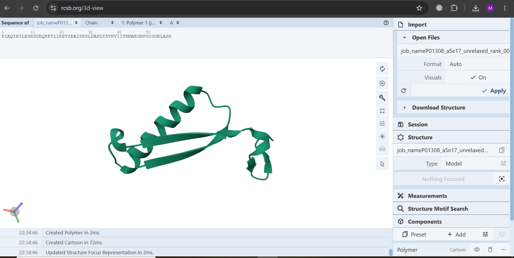

# Protein Structure Prediction

**Protein:** Human Insulin  
**UniProt ID:** P01308  
**Method:** AlphaFold2 Colab Notebook by DeepMind  
**GPU:** T4  
**Time:** 3 minutes  
**Best Model:** rank_001 unrelaxed.pdb

### Results
| File | Description |
| --- | --- |
| `P01308_Insulin_BestModel.pdb` | Predicted 3D structure - 8KB |
| `plddt_plot.png` | pLDDT confidence score >90 |
| `pae_plot.png` | Predicted Aligned Error |
| `coverage_plot.png` | MSA coverage |
| `uniref.a3m` + `bfd...a3m` | MSA evidence ~1MB |

### Notes
No coding required. Only job_name changed in official Colab notebook.
All files generated in 3 min on Google Colab T4 GPU.
